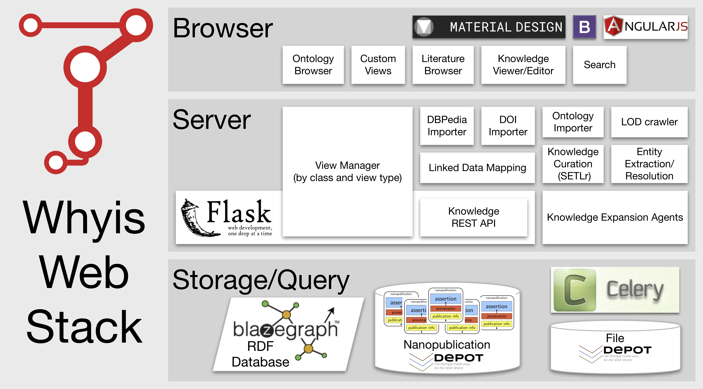

# Whyis: a nano-scale knowledge graph framework

Whyis is a nano-scale knowledge graph publishing, management, and analysis framework. 
Whyis aims to support domain-aware management and curation of knowledge from many different sources. Its primary goal is to enable creation of useful domain- and data-driven knowledge graphs. Knowledge can be contributed and managed through direct user interaction, statistical analysis, or data ingestion from many different kinds of data sources. Every contribution to the knowledge graph is managed as a separate entity so that its provenance (publication status, attribution, and justification) is transparent and can be managed and used. 

Whyis manages its fragments of knowledge as nanopublications, which can be viewed as the smallest publishable unit. They are fragments of knowledge graphs that have secondary graphs associated with them to contain provenance and publication information. Knowledge graph systems need to manage the provenance of its contents. By using existing recommended standards like RDF, OWL, and SPARQL, nanopublications are able to provide flexible expansion and integration options without the limitations of custom database management tools. They also have the flexibility to capture any level of granularity of information required by the application.

Every entity in the resource is visible through its own Uniform Resource Identifier (URI), and is available as machine-readable linked data. When a user accesses the URI, all the nanopublications about it are aggregated together into a single graph. This approach gives users the ability to control access to this knowledge. It also provides the ability to control the publishing workflow. Rather than publishing everything immediately, nanopublications can be contributed, curated and approved, and then finally published either individually or in collections. Knowledge graph developers can flexibly control the ways in which the entities are shown to users by their type or other constraints. We provide default views for knowledge graph authoring, including for ontology development and also allow developers to provide customized views. Our plan is to base our new enhanced Nanomine on the Whyis infrastructure to enable more flexibility and extensibility.

# Nano-scale?

Nano-scale knowledge graphs are built of many *[nanopublications](http://nanopub.org)*, where each nanopublication is tracked individually, with the ability to provide provenance-based justifications and publication credit for each tiny bit of knowledge in the graph.

> "A nanopublication is the smallest unit of publishable information: an assertion about anything that can be uniquely identified and attributed to its author."

**Assertion:** a minimal unit of thought

**Provenance:** the evidence and history of the assertion

**Publication Info:** metadata about how the nanopublication came to be

In Whyis, we do not require users to attempt to minimize a unit of thought.
Any set of assertions can bet taken together if they have the same provenance and publication information.
If, for instance, a knowledge graph needs to quote an ontology, it can do it in one nanopublication, even though they can be very large.
If the provenance of those assertions are held in common, it is reasonable to keep those as a single assertion.
However, if it is possible to break up assertions into smaller units, that will make them easier to manage and version.

# Whyis Architecture

Whyis is written in Python using the Flask framework, and uses a number of existing infrastructure tools to work, as shown below.
The RDF database used by default is [Blazegraph](https://www.blazegraph.com) which provides scale-out [horizontal scaling for large graphs](https://wiki.blazegraph.com/wiki/index.php/HAJournalServer).
Whyis uses the SPARQL 1.1 Query, Update, and Graph Store HTTP Protocol.
Any RDF database that supports those protocols can be a drop-in replacement for Blazegraph.
A read-only SPARQL endpoint is available via `/sparql`, along with a [Yet Another SPARQL GUI (YASGUI)-basedb UI](http://yasgui.org). 

>
>The Whyis technology stack. Current nanopublications are stored in the RDF database, while the entire history is stored in the nanopublication file archive using File Depot.  Files can be uploaded and stored in a special File Depot instance as well. Celery is used to invoke and manage a set of autonomic inference agents, which listen for graph changes and respond with additional nanopublications. Users interact with the graph through a set of views that are configured by node type and are based on the Flask templating system Jinja2.

Storage is provided using the [FileDepot Python library](http://depot.readthedocs.io) to provide file-based persistence of nanopublications and uploaded files.
FileDepot abstracts the storage layer to configurable backends, handles storage of content type, file names, and other metadata, and provides durable identifiers for each file.
It provides backends for a number of file storage methods, including local files, [Amazon S3](https://aws.amazon.com/s3), [MongoDB GridFS](https://docs.mongodb.com/manual/core/gridfs) and relational databases.

Whyis also relies on a task queuing system called [Celery](http://www.celeryproject.org) that can be scaled by adding more task workers on remote machines.
To support this, Whyis is configurable as a shared-nothing distributed system by configuring File Depot to use Amazon S3, GridFS, or one of the database storage backends.

Knowledge graph developers create their own knowledge graphs by generating a python module that contains the configuration, templates, and code that they need to customize Whyis to their purposes.
%Whyis is not editable from within Whyis, which makes Whyis developer-friendly.
Views, templates, and code all live within this revision control-friendly Python package to better enable the management and staging of a production system.
