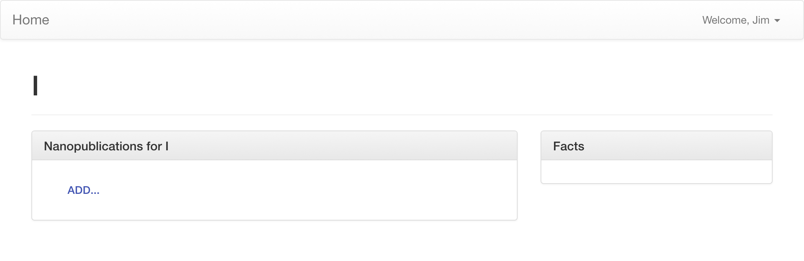

# Creating Satoru Views

**Before starting this tutorial, please make sure that you have created a Satoru extension using the instructions in [Advanced Configuration](https://tetherless-world.github.io/satoru/configuration).**

Satoru creates knowledge graphs like a wiki - every possible URL in your Satoru knowledge graph is a node waiting to be created.
We will walk through creating custom views in Satoru, and how to use them to display nodes based on their type.

## Every Page is a Node

Every URL in Satoru, except for some special ones like under `/static` (Javascript, CSS, images and such for Satoru), `/cdn` (custom Javascript, CSS, images and such), and `/sparql` are Resources, or nodes in the knowledge graph.
The URL naming scheme for your knowledge graph is up to you.
You can organize nodes by their source, by topic, or just have an infinitely flat space.

## Every node has a Type

When you visit a URL in Satoru, you will almost never get a 404.
Instead, you'll get a page about a node where nothing is known of it.
When there are no known types for a node, or the types given aren't given custom views, they are assumed to have the rdfs:Resource type, and are given the [rdfs:Resource default view](https://github.com/tetherless-world/satoru/blob/master/templates/resource_view.html).
This default view provides room to show statements about the node, the type, summary descriptions, and a list of nanopublications about the node.
There is also a UI for adding new nanopublications.
This template, resource_view.html, is a useful starting point when creating custom node views in Satoru.

We are also able to reference nodes outside of the Satoru namespace.
This makes it easier to import external knowledge from linked data and ontologies.
All URIs can be referenced using the `/about` URL, with a URL-encoded parameter of `uri`.
For instance, visit the page `/about?uri=https%3A%2F%2Fwww.w3.org%2FPeople%2FBerners-Lee%2Fcard%23i` to visit Tim-Berners Lee's URI for himself.




## Creating a Custom Default View

Let's create a custom default view for foaf:Person.
We can start by modifying your extension's `vocab.ttl` file to add the following:

```turtle
<http://xmlns.com/foaf/0.1/Person> a owl:Class;
    graphene:hasView "person_view.html".
```

Next, create a file in you extension called `templates/person_view.html` and add the following:

```




{{get_label(this.description())}}

<div class="row" >
  <div class="col-md-8">
    {{ summary_panel(this.description()) }}
  </div>
</div>

```

This a very simplified page 
